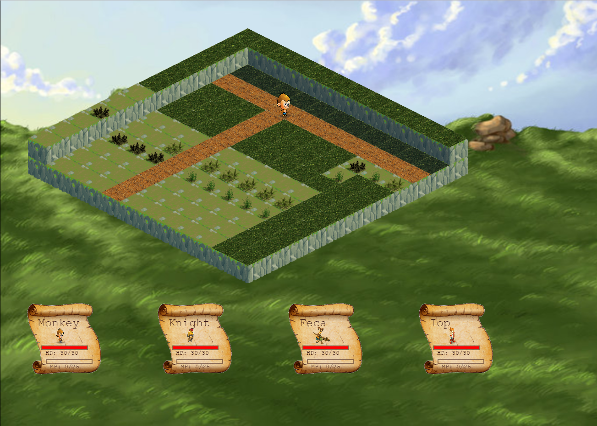
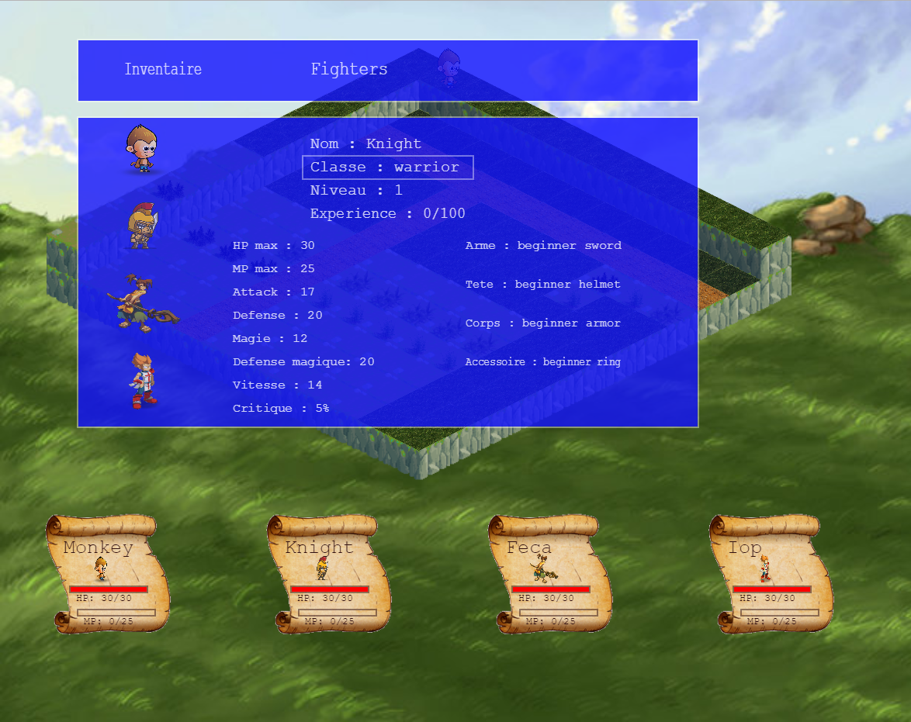
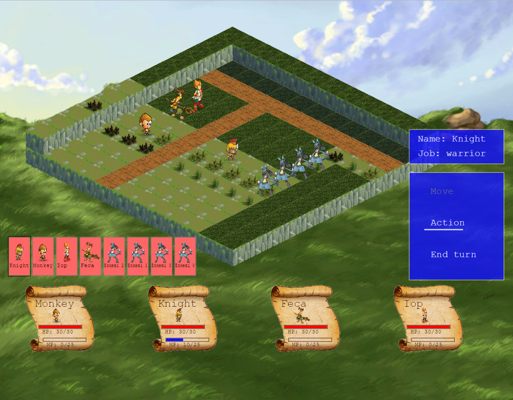

# Projet_DEC_RPG
Projet final de mon DEC, web based RPG en 2D Isometrique

<!DOCTYPE html>
<html lang="fr">
    <head>
        <title>Projet: RPG</title>
        <link href="CSS/style.css" rel="stylesheet" />
        <meta charset="utf-8"/>
    </head>
    <body>
        

            
<a href="index.html">Acceuil</a>

            
<a href="Game/index.html">Game</a>

        

		<main>
            <h1>
                Projet DEC: RPG Iso
            </h1>

			<h2>Acceuil</h2>
			

				RPG ISO est un RPG code dans le cadre du cours de B65_Synthese.
                 
                Ce Projet a ete code en javascript a l'aide de JSISO, une librairie isometric en javascript.
                 
                Le but de ce projet est la creation d'un systeme de combat de 2D isometrique, ainsi que la creation d'un systeme d'inventaire et d'equipement.
                 
                Le temps investi sur ce projet est d'environ 70 heures.
                 
                 
                Le but du jeu est de combattre des creatures dans un monde fantastique, ainsi que de se deplacer dans ce monde via des maps interconnectees
                 
                 
                
                 
                Ecran principal, personnage situe sur la carte du monde.
                 
                
                 
                Menu de modification d'equipement. Les stats des personnages sont egalement accessibles a partir de ca menu
                 
                
                 
                Interface de combat. Les ennemis sont geres grace a une intelligence artificielle
                 
                <video width="800" height="550" controls>
                    <source src="Video/B65_S3_Video_ClovisPerin.mp4" type="video/mp4">
                </video>
                 
                Je voudrais remercier tout les profs d'informatique du CVM, ainsi que Beakers pour sa librairie JSISO, qui m'a aide a faire ma representation en 2D isometrique:<a href="http://jsiso.com/"> JSISO website</a>

		</main>
        Coordonees: clo.perin@gmail.com
    </body>
</html>
